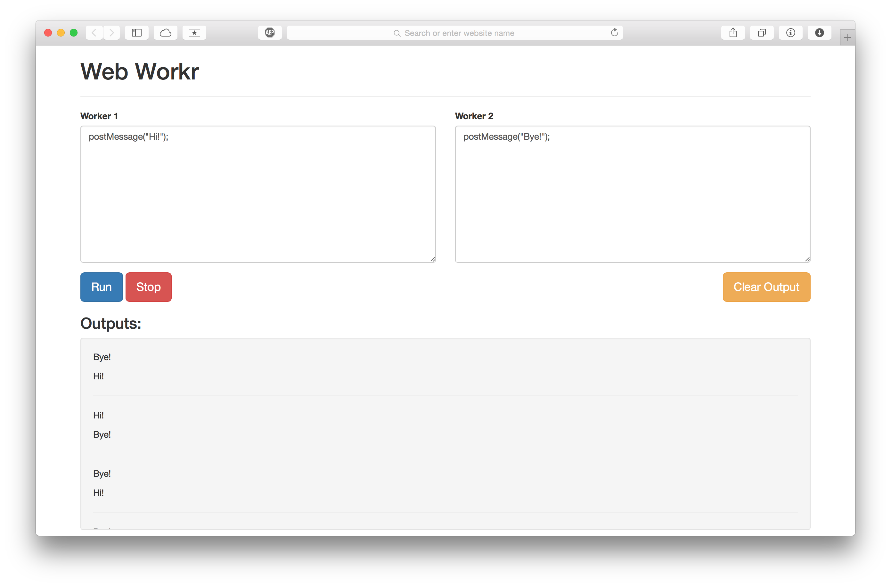

Web Workr - A taste of Javascript Concurrency
=============================================

This is a simple tool for experiencing the HTML web workers. 

### How to use
Enter different programs for the two workers and click "Run". 

Use `postMessage` to send print output.

Notice that the order of execution is unpredictable. 

### Example

